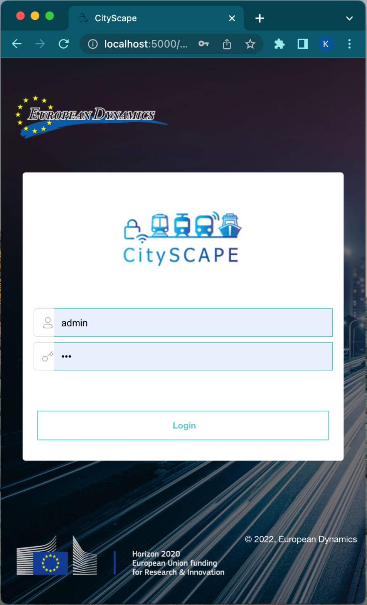
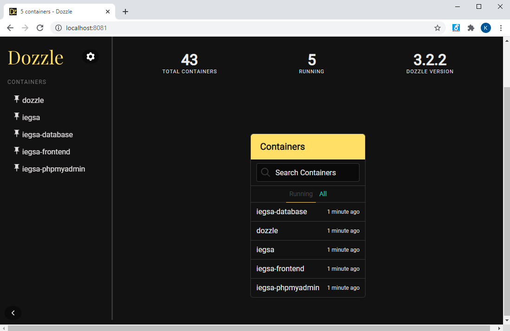
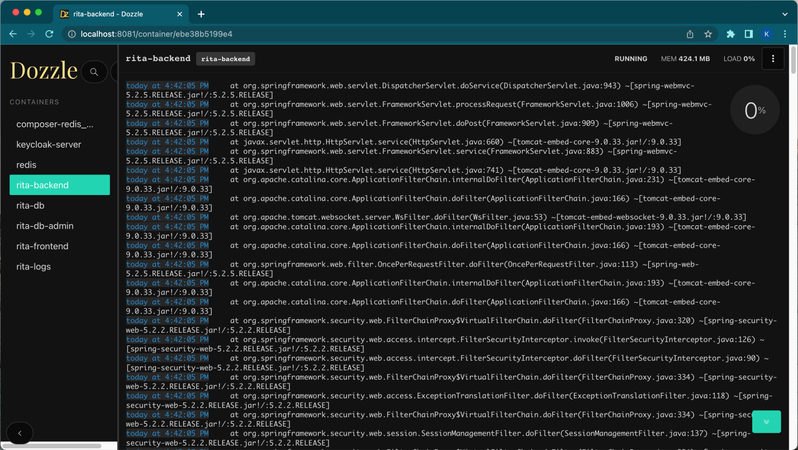

# **Deployment guide**
1. ## ` `Docker Installation on Windows
RITA software and its components will be delivered utilizing the Docker containers functionalities. The delivered is configured to be containerized in four images that will be up and running four different and isolated virtual machines, accordingly. A detailed description on the separate images, their configuration and interaction will follow in the following sections. 

Firstly, the Docker platform has to be downloaded and installed accordingly to the OS of the server to host the deployment.
### ***For Windows server***
**1.** Install Docker from <https://hub.docker.com/?overlay=onboarding> (First you will need to create an account on the same page) 

**2.** After the installation if Docker has not started automatically open start Menu, type Docker and select the Docker icon that appears.

**3.** Docker may take some time to start. When it has successfully started you should able to see the icon on the bottom right of your screen. 

**4.** Troubleshooting.

*a.* Docker in order to run requires specific support from the cpu but most recent PCs should support it. 

*b.* Hyper-V should be installed and enabled in windows and Virtualization should be enabled in your BIOS.  Please also consult the following page <https://docs.docker.com/docker-for-windows/troubleshoot/#virtualization/> .
### ***For Linux*** 
Install Docker Engine on Ubuntu

Prerequisites

OS requirements

To install Docker Engine, you need the 64-bit version of one of these Ubuntu versions:

- Ubuntu Groovy 20.10
- Ubuntu Focal 20.04 (LTS)
- Ubuntu Bionic 18.04 (LTS)
- Ubuntu Xenial 16.04 (LTS)

Docker Engine is supported on x86\_64 (or amd64), armhf, and arm64 architectures.

Uninstall old versions

Older versions of Docker were called docker, docker.io, or docker-engine. If these are installed, uninstall them:

$ sudo apt-get remove docker docker-engine docker.io containerd runc

It’s OK if apt-get reports that none of these packages are installed.

The contents of /var/lib/docker/, including images, containers, volumes, and networks, are preserved. If you do not need to save your existing data, and want to start with a clean installation, refer to the uninstall Docker Engine section at <https://docs.docker.com/engine/install/ubuntu/#uninstall-docker-engine> .

Installation

The Docker Engine can be installed by setting up the Docker’s repositories and installing directly from them, fact which eases the installation and subsequent upgrade tasks.

Before you install Docker Engine for the first time on a new host machine, you need to set up the Docker repository. Afterward, you can install and update Docker from the repository.

SET UP THE REPOSITORY

1. Update the apt package index and install packages to allow apt to use a repository over HTTPS:

$ sudo apt-get update

$ sudo apt-get install \

`    `apt-transport-https \

`    `ca-certificates \

`    `curl \

`    `gnupg-agent \

`    `software-properties-common

1. Add Docker’s official GPG key:

$ curl -fsSL https://download.docker.com/linux/ubuntu/gpg | sudo apt-key add -

Verify that you now have the key with the fingerprint 9DC8 5822 9FC7 DD38 854A  E2D8 8D81 803C 0EBF CD88, by searching for the last 8 characters of the fingerprint.

$ sudo apt-key fingerprint 0EBFCD88

pub   rsa4096 2017-02-22 [SCEA]

`      `9DC8 5822 9FC7 DD38 854A  E2D8 8D81 803C 0EBF CD88

uid           [ unknown] Docker Release (CE deb) <docker@docker.com>

sub   rsa4096 2017-02-22 [S]

Use the following command to set up the stable repository. To add the nightly or test repository, add the word nightly or test (or both) after the word stable in the commands below. Learn about nightly and test channels.

Note: The lsb\_release -cs sub-command below returns the name of your Ubuntu distribution, such as xenial. Sometimes, in a distribution like Linux Mint, you might need to change $(lsb\_release -cs) to your parent Ubuntu distribution. For example, if you are using Linux Mint Tessa, you could use bionic. Docker does not offer any guarantees on untested and unsupported Ubuntu distributions.

x86\_64 / amd64

armhf

arm64

$ sudo add-apt-repository \

`   `"deb [arch=amd64] https://download.docker.com/linux/ubuntu \

`   `$(lsb\_release -cs) \

`   `stable"

INSTALL DOCKER ENGINE

1. Update the apt package index, and install the latest version of Docker Engine and containerd, or go to the next step to install a specific version:

` `$ sudo apt-get update

` `$ sudo apt-get install docker-ce docker-ce-cli containerd.io

*Got multiple Docker repositories?*

*If you have multiple Docker repositories enabled, installing or updating without specifying a version in the apt-get install or apt-get update command always installs the highest possible version, which may not be appropriate for your stability needs.*

1. To install a specific version of Docker Engine, list the available versions in the repo, then select and install:

a. List the versions available in your repo:

$ apt-cache madison docker-ce

`  `docker-ce | 5:18.09.1~3-0~ubuntu-xenial | https://download.docker.com/linux/ubuntu  xenial/stable amd64 Packages

`  `docker-ce | 5:18.09.0~3-0~ubuntu-xenial | https://download.docker.com/linux/ubuntu  xenial/stable amd64 Packages

`  `docker-ce | 18.06.1~ce~3-0~ubuntu       | https://download.docker.com/linux/ubuntu  xenial/stable amd64 Packages

`  `docker-ce | 18.06.0~ce~3-0~ubuntu       | https://download.docker.com/linux/ubuntu  xenial/stable amd64 Packages

`  `...

b. Install a specific version using the version string from the second column, for example, 5:18.09.1~3-0~ubuntu-xenial.

$ sudo apt-get install docker-ce=<VERSION\_STRING> docker-ce-cli=<VERSION\_STRING> containerd.io

Verify that Docker Engine is installed correctly by running the hello-world image.

$ sudo docker run hello-world

This command downloads a test image and runs it in a container. When the container runs, it prints an informational message and exits.

Docker Engine is installed and running. The docker group is created but no users are added to it. You need to use sudo to run Docker commands. Continue to Linux postinstall to allow non-privileged users to run Docker commands and for other optional configuration steps.
1. ## RITA deployment
RITA will be available online in six specified co-existing docker images to efficiently distribute the software avoiding the likelihood of collisions. Therefore, there is one image specified to host the backend application (rita-backend) as well as one for the frontend application (rita-frontend). Tow other docker images are created to host the RITA database (rita-db) and the PhpMyAdmin application (phpmyadmin) to be able to access the Database from a Ui for administrative purposes, also an image with Redis server (redis) is created and used by rita for cacheing and the sixth docker image provides access and navigation to the log files of rita and is used for debugging purposes.

To proceed with the installation of RITA, the user must use the rita-compose folder that contains all the necessary configuration of the backend, frontend and the database, accordingly. 

You can configure a number of aspects such as URLs, ports & connections between the defined components. All the configuration is located on the *“rita-composer/docker-compose.yml”*

|
version: "3.7"

services:

`  `**db**:

`    `image: mariadb:10.5

`    `command: --default-authentication-plugin=mysql\_native\_password

`    `container\_name: rita-db

`    `environment:

`      `MYSQL\_ROOT\_PASSWORD: root

`    `ports:

`      `- "4822:3306"

`    `volumes:

`      `- ./mysql-files:/var/lib/mysql

`      `- ./mysql-scripts:/docker-entrypoint-initdb.d

`    `restart: always

`    `networks:

`      `- rita 

` `**phpmyadmin**:

`    `image: phpmyadmin/phpmyadmin:latest

`    `restart: always

`    `environment:

`      `PMA\_HOST: db

`      `PMA\_USER: root

`      `PMA\_PASSWORD: root

`    `ports:

`      `- "4801:80"

`   `networks:

`      `- rita

`  `**redis**:

`    `image: "redis:alpine"

`    `container\_name: redis

`    `command: redis-server --requirepass redls133o1q@z

`    `ports:

`      `- "6399:6379"

`    `volumes:

`      `- $PWD/redis-data:/var/lib/redis

`      `- $PWD/redis.conf:/usr/local/etc/redis/redis.conf

`    `environment:

`      `- REDIS\_REPLICATION\_MODE=master

`    `networks:

`      `- rita

`  `**dozzle**:

image: amir20/dozzle

container\_name: rita-logs

`    `restart: always

`    `volumes:

`      `- /var/run/docker.sock:/var/run/docker.sock

`    `ports:

`      `- "8081:8080"

`   `networks:

`      `- rita

`  `**rita-backend**:

`    `build:

`      `context: ./rita-backend

`      `args:

`        `DB\_IP: rita-db

`        `DB\_PORT: 3306

`        `DB\_NAME: rita

`        `DB\_USERNAME: root

`        `DB\_PASSWORD: root

`        `RMT: https://rmt.ds.unipi.gr

`        `REDIS\_HOST: redis

`        `REDIS\_PORT: 6399

`        `REDIS\_PASSWORD: redls133o1q@z

`      `dockerfile: Dockerfile

`    `image: rita-backend

`    `container\_name: rita-backend

`    `ports:

`      `- "15502:15502"

`    `restart: always

`    `networks:

`      `- rita

`  `**rita-frontend**:

`    `build:

`      `context: ./rita-frontend

`      `dockerfile: Dockerfile

`      `args:

`        `BACKEND\_URL: http://localhost:15502/api

`    `image: rita-frontend

`    `container\_name: rita-frontend

`    `ports:

`      `- "5000:80"

`    `restart: always

`    `networks:

`      `- rita

**networks**:

`  `rita:

`    `name: rita

`    `driver: bridge
|
| - |

On this file we can clearly see the four containers and their subsequent configuration. The most important parameter that we can change are the ports of every application, the backend’s connection to the database, the backend’s connection to the RMT services, the frontend connection url to the backend, and the database credetials.

Deployment process

To perform the deployment of RITA, one have to proceed with the following steps:

1. ` `Open the Command Prompt window and navigate to the rita-composer folder. 

\2. In the new window, type 

CONFIGURATION=<parameter> docker-compose up --build -d 

and press <enter>.

The deployment will start automatically.

This command automatically downloads four docker images; The six images are being configure and deployed into four containers as described earlier. After the instantiation of the images (via Docker containers) and the proper setting of localhost server ports, one may login navigate to RITA platform using the local address and the exposed port defined on the **rita-frontend** section of the docker-composer.yml file. Therefore, for the above configuration access can be performed via  [*http://localhost:5000/](http://localhost:8080/)*   

Finally you can stop rita with the following command, while you are on the deployment folder docker-compose down.

Update process

RITA updates are automatic and available online on dockerhub. In order to upgrade to the latest versions follow the steps below

1. Navigate to the folders in which you have cloned the repository 
1. https://github.com/european-dynamics-rnd/CitySCAPE-DRAS

**2.** Run the following commands inside the docker-compose-files/ directory (where *docker-compose.yml* is located)

**a.** Stop the current instance of rita

docker-compose down

**b.** Pull the latest version of the starting scripts. Here since you made changes to the *docker-compose.yml* these may be overwritten. Either stash/merge the changes or reinsert them after the pull.

git pull

**c.** Delete the containers of the previous version 

docker image rm eurodynrnd/rita-backend eurodynrnd/rita-frontend rita-backend rita-frontend

**d.** Change any parameters as necessary inside the *docker-compose.yml* and run the following command to download and run the new version

CONFIGURATION==<parameter>  docker-compose up --build

1. ## Dozzle - Rita logs inspection
You can navigate the log inspection on the <http://localhost:8081/> address using your browser.

On the main screen you can see all the running containers and you must select the rita container to navigate to the rita applications logs. 

Finally on this screen you can navigate, search or download the log files. 
