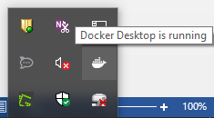
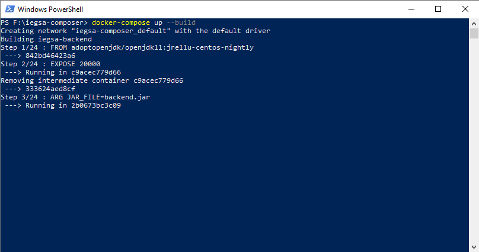

## **Dynamic Risk Assessment System Deployment guide**
#### **Prerequisites and Installation**
The hardware and operating system prerequisites are:

- A 2-core processor 
- 4GB RAM Memory
- 50GB of disk space or more

The software prerequisites include:

- Centos 7 or Windows Server Operative System (OS);
- docker and docker-compose;

RITA software and its components will be delivered utilizing the Docker containers functionalities. Firstly, the Docker platform has to be downloaded and installed accordingly to the OS of the server to host the deployment. 

**For Windows server**

1. Install Docker from <https://hub.docker.com/?overlay=onboarding> (First you will need to create an account on the same page)
1. After the installation if Docker has not started automatically open start Menu, type Docker and select the Docker icon that appears.


*Figure 1. Launching Docker (Windows Server)*

3. Docker may take some time to start. When it has successfully started you should able to see the icon on the bottom right of your screen



*Figure 2. Docker Successfully Started (Windows Server)*

**Troubleshooting:**

- Docker in order to run requires specific support from the CPU but most recent PCs should support it. 
- Hyper-V should be installed and enabled in windows and Virtualization should be enabled in your BIOS.  Please also consult the following page <https://docs.docker.com/docker-for-windows/troubleshoot/#virtualization/> .

**For Linux server**

1. Update the apt package index and install packages to allow apt to use a repository over HTTPS. 

For 64-bit version of CentOS type:
```
$ sudo yum update

$ sudo yum install \
 apt-transport-https \
 ca-certificates \
 curl \
 gnupg-agent \
 software-properties-common
```

For 64-bit version of one of Ubuntu versions (Groovy 20.10, Focal 20.04 (LTS), Bionic 18.04 (LTS), Xenial 16.04 (LTS)) type:
```
$ sudo apt-get update

$ sudo apt-get install \
apt-transport-https \
ca-certificates \
curl \
gnupg-agent \
software-properties-common
```
2. Add Docker’s official GPG key

`$ curl -fsSL https://download.docker.com/linux/ubuntu/gpg | sudo apt-key add -`

3. Verify the key by searching for the last 8 characters of the fingerprint.

`sudo apt-key fingerprint <last 8 characters of the fingerprint >`

4. Install Docker. According to the Docker installation[^1] we should:
- Set up the Docker repository.

For 64-bit version of CentOS type:
```
$sudo yum install -y yum-utils
$sudo yum-config-manager \
  --add-repo \
  https://download.docker.com/linux/centos/docker-ce.repo
```
For 64-bit version of Ubuntu use the following command to set up the stable repository:
```
$ sudo add-apt-repository \
   "deb [arch=amd64] https://download.docker.com/linux/ubuntu \
$(lsb_release -cs) \
   stable"
```
- Install the latest version of Docker Engine and *containerd*.

For 64-bit version of CentOS type:

`$sudo yum install docker-ce docker-ce-cli containerd.io`

For 64-bit versions of Ubuntu type:

`$ sudo apt-get install docker-ce docker-ce-cli containerd.io`

- Start and enable docker by typing:
```
$sudo systemctl start docker
$sudo systemctl enable docker
```
- Verify that Docker Engine is installed correctly by running the hello-world image:
  
`$ sudo docker run hello-world`

This command downloads a test image and runs it in a container. When the container runs, it prints an informational message and exits

5. Install Docker compose. Docker Compose is a tool for defining and running multi-container Docker applications. With Compose, we use a YAML Ain't Markup Language (YAML) file to configure our application’s services. Then, with a single command, we create and start all the services from our configuration. According to the docker compose installation  we should:
- Download the current stable release of Docker Compose, by typing:
  
`$ curl -L "https://github.com/docker/compose/releases/download/1.28.2/docker-compose-$(uname -s)-$(uname -m)" -o /usr/local/bin/docker-compose`

- Apply executable permissions to the binary, by typing:

`$sudo chmod +x /usr/local/bin/docker-compose`

RITA-DRAS is available online in six specified co-existing docker images to efficiently distribute the software avoiding the likelihood of collisions. Therefore, there is one image specified to host the backend application (*dras-backend*) as well as one for the frontend application (*dras-frontend*). Two other docker images are created to host the RITA database (*dras-db*) and the PhpMyAdmin application (*phpmyadmin*) to be able to access the database from a UI for administrative purposes, also an image with Redis server (*redis*) is created and used by RITA-DRAS for caching and the sixth docker image provides access and navigation to the log files of RITA-DRAS and is used for debugging purposes.

To proceed with the installation of RITA-DRAS, the user must use the *dras-compose* folder that contains all the necessary configuration of the backend, frontend and the database.

6. Next step is to deploy RITA DRAS using Docker Compose. First step is to clone the <https://github.com/european-dynamics-rnd/CitySCAPE-DRAS>  repository, by typing:
```
cd /opt/rita/
git clone https://github.com/european-dynamics-rnd/CitySCAPE-DRAS.git
```
7. Use the following yml file (docker-compose.yml), located under */opt/rita/dras-compose/* to configure all aspects of the DRAS container:
```
version: "3.7"
services:
  db:
    image: mariadb:10.5
    command: --default-authentication-plugin=mysql_native_password
    container_name: dras-db
    environment:
      MYSQL_ROOT_PASSWORD: root
    ports:
      - "4822:3306"
    volumes:
      - ./mysql-files:/var/lib/mysql
      - ./mysql-scripts:/docker-entrypoint-initdb.d
    restart: always
    networks:
      - dras 
 phpmyadmin:
    image: phpmyadmin/phpmyadmin:latest
    restart: always
    environment:
      PMA_HOST: db
      PMA_USER: root
      PMA_PASSWORD: root
    ports:
      - "4801:80"
   networks:
      - dras
  redis:
    image: "redis:alpine"
    container_name: redis
    command: redis-server --requirepass redls133o1q@z
    ports:
      - "6399:6379"
    volumes:
      - $PWD/redis-data:/var/lib/redis
      - $PWD/redis.conf:/usr/local/etc/redis/redis.conf
    environment:
      - REDIS_REPLICATION_MODE=master
    networks:
      - dras
  dozzle:
image: amir20/dozzle
container_name: dras-logs
    restart: always
    volumes:
      - /var/run/docker.sock:/var/run/docker.sock
    ports:
      - "8081:8080"
   networks:
      - dras
  dras-backend:
    build:
      context: ./dras-backend
      args:
        DB_IP: dras-db
        DB_PORT: 3306
        DB_NAME: dras
        DB_USERNAME: root
        DB_PASSWORD: root
        RMT: https://rmt.ds.unipi.gr
        REDIS_HOST: redis
        REDIS_PORT: 6399
        REDIS_PASSWORD: redls133o1q@z
      dockerfile: Dockerfile
    image: dras-backend
    container_name: dras-backend
    ports:
      - "15502:15502"
    restart: always
    networks:
      - dras
  dras-frontend:
    build:
      context: ./dras-frontend
      dockerfile: Dockerfile
      args:
        BACKEND_URL: https://cityscape-rita.eurodyn.com/api
    image: dras-frontend
    container_name: dras-frontend
    ports:
      - "5000:80"
    restart: always
    networks:
      - dras
networks:
  dras:
    name: dras
    driver: bridge
```
8. Finally execute:
   
```
$cd dras-compose
$docker-compose up –d
$docker-compose logs -f
```
9. If no errors are seen, this means that DRAS was successfully deployed. We can validate that by typing in a web-browser: http://localhost:5000 resulting in the next screen.




[^1]: <https://docs.docker.com/engine/install/centos/> 
